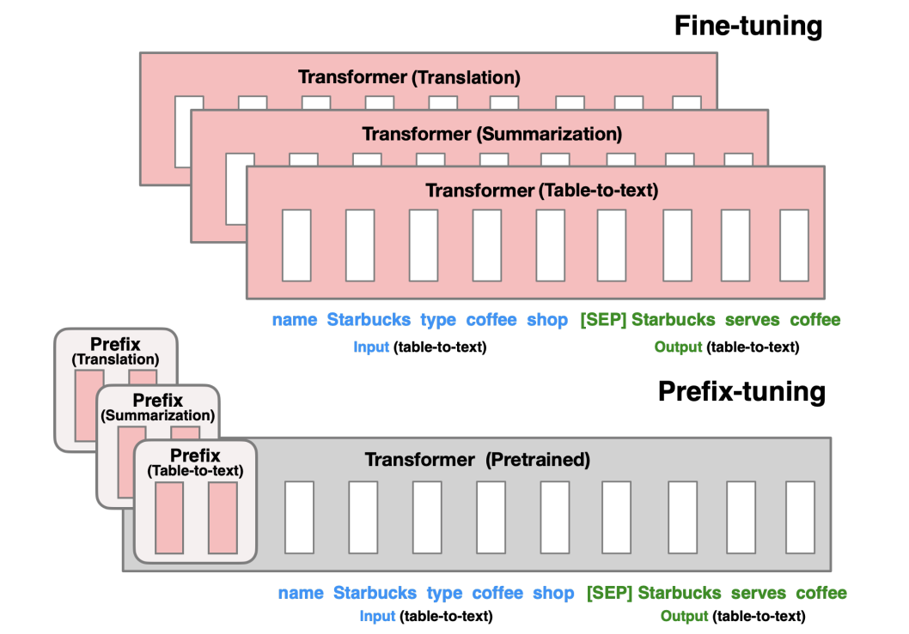
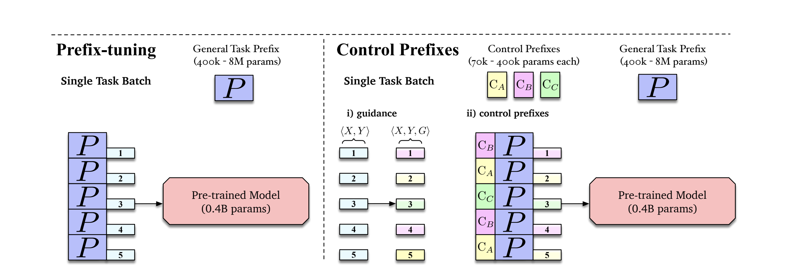

### Introduction

**Introduce the general area of the research**

My thesis will be written on the domain of Natural Language Generation (NLG). Specifically, on data-to-text generation in (Dutch) news. In data-to-text, a language model produces a sequence of words based on a table of structured data. My thesis is written as part of an internship at DPG Media. For this reason, I want to give special attention to the Dutch news domain.

The current state-of-the-art for data-to-text is achieved by utilizing a large pre-trained language model (LM). The structural input is linearized and fed to the network as a sequence of tokens. The language model can be fine-tuned on task-specific data to obtain the highest possible performance.

The most recent examples of pre-trained language models are GPT-2, BART and T5. All of these are Transformer-based models. As Google's T5 achieves the current state-of-the-art performance on most language generation tasks, our research will focus on this pre-trained model. Following the release of T5, researchers have trained a multilingual version of this model. This will allow for research in English as well as in Dutch and other languages.

A current focus of the field is to capture structural data in a more efficient way than linearization. One line of research employs graph convolutional networks (GCNs) to do this. Another problem with large pre-trained LMs is that it is necessary to finetune billions of parameters for a single task. The resulting parameter space is often very close to the original one, suggesting that more efficient ways of fine-tuning are possible.

### Problem Statement

**What is the fundamental research problem that you aim to solve?**
 
A proposed way of efficient fine-tuning is through learning prefixes. This method only learns about 0.1% of the parameters necessary for fine-tuning an entire language model. 

A language model takes in a series of input IDs. Each ID stands for a token that is present in the input sequence. The model then encodes this vector of IDs into an embedding that represents meaning in the context of the input sequence. Prefixes are continuous embedding vectors that are virtual 'tokens' prepended before the actual input tokens are processed. These prefixes can be conditioned on a single dataset, or more finegrained on input (meta)data and are learned through updating a single weight matrix while executing a generation task. The parameters of the pre-trained LM are all frozen.

Alhough prefix-tuning has shown to achieve SOTA performance on English data-to-text tasks, it has received relatively little attention. The main goal of this thesis is to evaluate prefix-tuning in alternative settings and experiment with the technique to achieve higher performance.

**Why is the problem important?**

Natural language modelling has shown great promise on a wide range of tasks. However, a single model already has billions of parameters. When fine-tuning for individual tasks, billions of new parameters are introduced for every new task. A 'new task' can already be interpreted as something as small such as learning a task for a single user. This makes it important for finetuning approaches to become more scalable, especially when when deployed in a production environment. Otherwise, memory requirements and development time will greatly increase. This will then have a large impact on energy consumption resulting in business costs and ecological footprint.

Prefix-tuning is extremely scalable and should thus be preferred when it can be shown that performance doesn't suffer from the limited expressiveness.

**Why is the problem non-trivial?**

Reducing the amount of parameters while increasing performance is a task that required a lot of experimentation to get at the current situation. Converting this to a multilingual setting or conditioning on a different piece of data makes it hard to predict what the final performance will be.

**Why is the problem not solved by the current state-of-the-art**

The current state of the art relies on training huge language models for specific tasks and linearizing the input data without looking at the structure of the data. Only recently researchers have made an effort to come up with more intelligent ways of processing and training.

### Proposed Approach & Contributions

**Sketch the method that you aim to develop to solve the outlined problem**
My thesis will focus on experimenting with different applications and approaches of prefix-tuning. These are the following:

- **The performance of prefix-tuning in a multilingual setting**
   Prefix-tuning has shown excellent performance on language generation tasks. The WebNLG challenge is an English benchmark for data-to-text generation that this was measures on. However, we ask the question if the limited amount of prefix parameters contains enough expressiveness when the used pre-trained LM is multilingual? We can experiment with conditioning the prefix on the language of an input sequence
   
- **Conditioning prefix on structural information**
   Can we condition our prefix on information obtained by doing more with the structure found in the input data. For example, can we use a GCN to create a representation of the input sequence and use this as a prefix. Or simply stated, will making our prefix 'network' more complex result in better results?
   
**List the novel contributions provided by your approach**

Prefix-tuning is a novel approach that has only been explored to a certain amount. I will show whether or not the limited expressiveness of prefix-tuning will work with a multilingual LM which per definition contains more expressiveness. 

I will also condition the prefix on some (meta)data that can be found in the functional relations of data to see if such data can improve performance. In this step we could possibly introduce GCNs 

A final contribution could be the introduction of a Dutch soccer dataset containing match statistics and summaries.

### Example

**Create an example, ideally with a figure, which exemplifies the problem and can be used to guide readers through your proposed approach**
 

In the figure above (from the original prefix-tuning paper), it be seen how prefix-tuning differs from fine-tuning. Instead of finetuning an entire language model, a prepended prefix is tuned and the LM is frozen. Our idea is to experiment with the pre-trained Transformer being multilingual and evaluating on datasets in different languages.

The figure above comes from the Control Prefixes paper. This approach combines a general task prefix with control prefixes which are based on metadata of the input sequence. This can be a certain dataset category for example. We propose using this guidance prefix to be connected to the language of the input. 

We would also like to experiment with prepending a graph representation of the data structure to the input sequence to help the network capture the structural relations found in the input. We could combine this with a general prefix as can be seen in the first figure.

### Experimental Evaluation

**How should the quality of your method be measured?**

We will evaluate our method based on standard text generation metrics like BLEU, METEOR, BLEURT, etc. For each structured data sample we have a corresponding textual description, allowing us to use these metrics.

It would also be interesting to do a qualitative analysis of our approach at DPG Media, the company this thesis is written at. 

**What are baseline techniques that your method should be compared to?**

For evaluating performance, our method should be compared to fine-tuning a full language model on the provded dataset. Of course our method should be compared to existing prefix-tuning methods as well, to give a clear picture of the performance of prefix-tuning in different settings.

**Sketch potential experiments and expected outcomes (on a high-level)**

*work in progress*

### Related Work

**List the most important related work, ideally with a paper reference and a one-sentence description**

[Text-to-Text Pre-Training for Data-to-Text Tasks](https://aclanthology.org/2020.inlg-1.14.pdf)
Introduces fine-tuning for Data-to-Text tasks using T5.

[Prefix-Tuning: Optimizing Continuous Prompts for Generation](https://aclanthology.org/2021.acl-long.353.pdf)
Introduces prefix-tuning as a more efficient way of fine-tuning for data-to-text tasks.

[Control Prefixes for Text Generation](https://arxiv.org/abs/2110.08329)
Extends prefix-tuning so it is able to condition on input-based metadata.

### Open Questions

**List open questions not covered by the proposal**

*work in progress*

### Next Steps

**Describe what the immediate next steps for the proposed work should be**

*work in progress*
